# About
**Banasthalite Online Exchange Market** is a web application for easy exchange of
goods i.e. second hand books,stationary materials etc among students of
Banasthali Vidyapith. The website is developed for two types of users – sellers and
buyers(both are the students of Banasthali).A student can act as a seller, or as a
buyer or both but in only one role at a time.Our website will act as a medium
among the students for purpose of exchanging goods and indirectly help them in
purchasing, selling and renting goods.The aim of this project
is to reduce the efforts of selling and buying among students and provide them the
ease for renting their items as well. Students can easily search for items of their
need and accordingly interact with the seller.

## Techenology Used
It is a dynamic website developed using
JSP. The content displayed on the website is dynamically generated, depending on
the requests sent from the client’s browser. It uses both client-side scripting and
server-side scripting. Client-side scripting is achieved by the use of HTML, CSS
and JavaScript. It is used for customizing the display (different for each student).
Server- side scripting is achieved through JSP and is used for form processing,
building and displaying pages created from the database.

## How it works?
<h4> Master Page</h4>
First of all, we run the server using Netbeans GlassFish Server Open Source Edition  4.1.1 and then open this on browser. The master page look like this
There are five sections on this page

* About Us
* Help
* Contact Us
* Login
* Sign Up
  
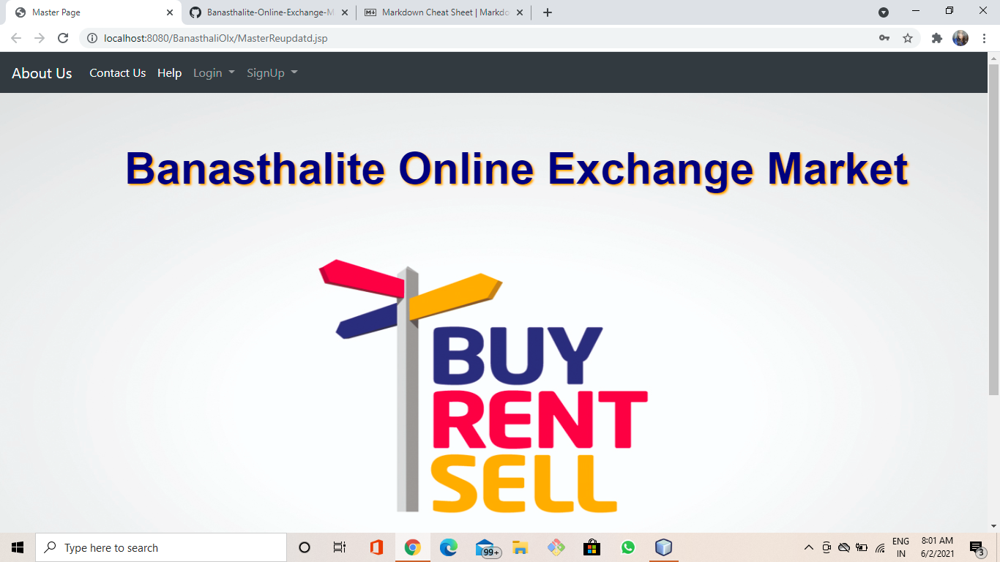

<h4>About Us</h4>
Once you click on About us section, you will be redirected to about us within the same page. It is brief Description of our website
  
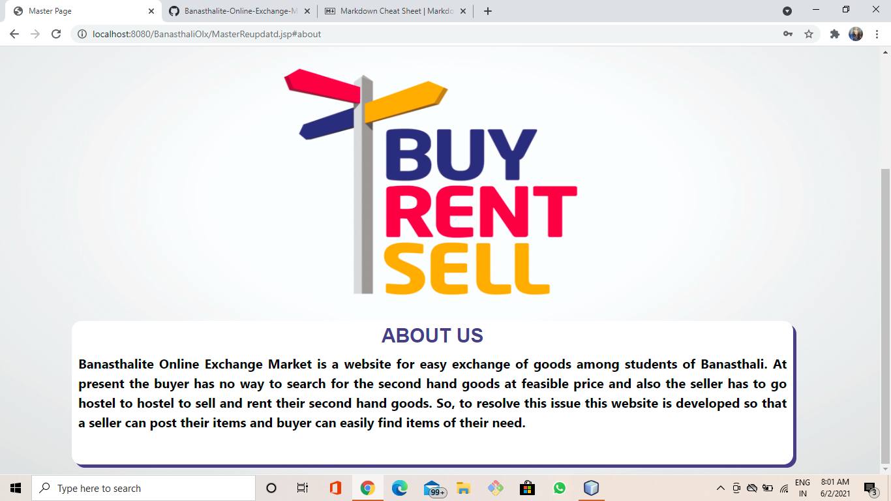

<h4>Help</h4>

So to help you out,we have put together this simple,easy,step by step guide in this **Help** section. Once, you click on this button you will see a quick overview.

<h4>Contact Us</h4>

The user can contact us by filling out this "Contact Us" form for further help.
  
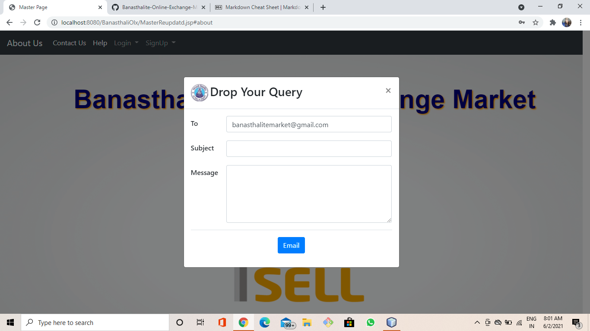

<h4>Sign Up</h4>
You need to register yourself first by filling this Sign Up form.Once you click on this sign up button, you will see these options. Its your choice to register yourself either as a seller or as a buyer or both.
  

<h4>Seller Registration Form</h4>
  
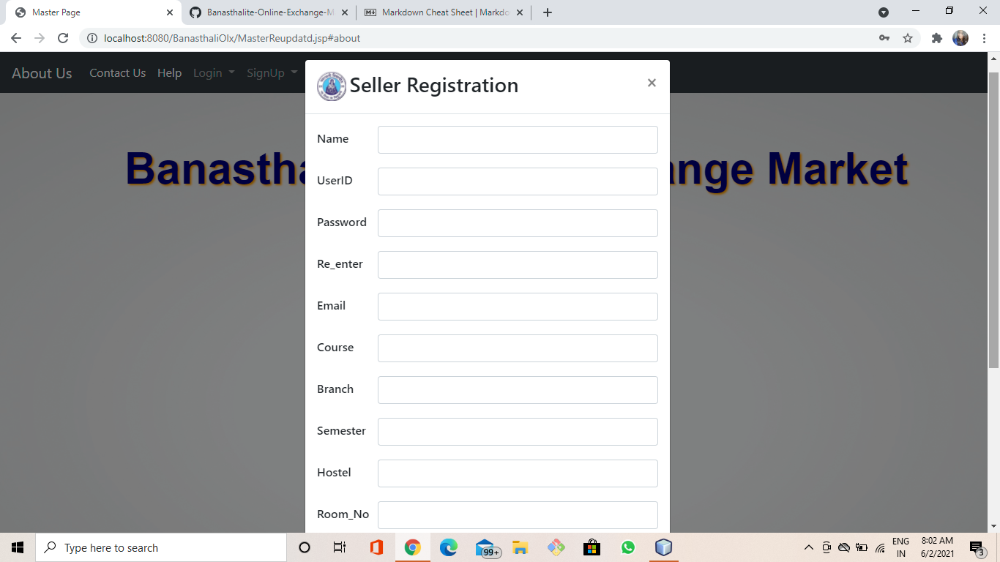

<h4>Buyer Registration Form</h4>
  
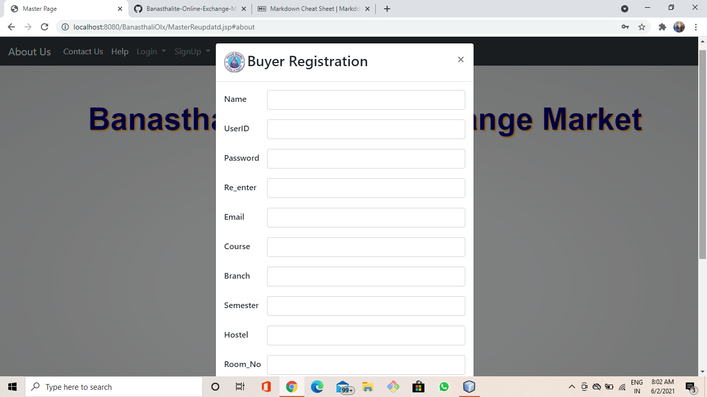

**You are ready to Login.Enter your login details in the form. You can reset your password also if needed**
<h4>Seller Login Form</h4>
  

<h4>Buyer Login Form</h4>
  
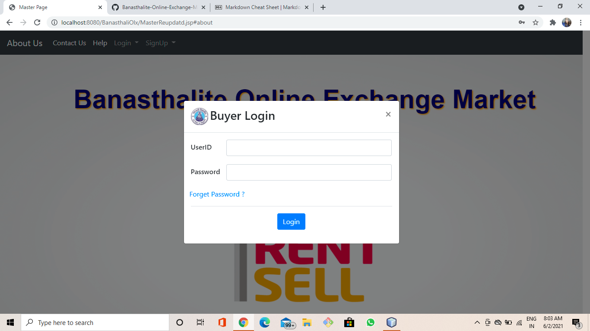

**You will be redirected to Seller and Buyer Home Page correspondingly once you logged in Successufully**

  <h4>Seller Home Page </h4>
  The top right section has two buttons Rent and Buyer. The seller will be redirected to the rent section once she click on rent button and she can switch to buyer section   with the help of buyer button if she wished to 
    
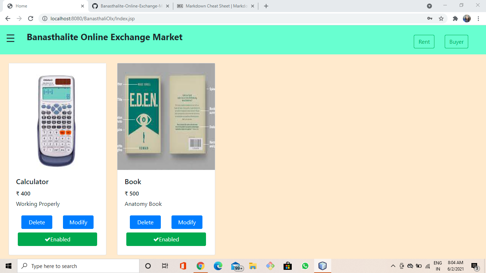

<h4>Seller side Exploration </h4>
the top left section has a menu bar where we have have these options

* Add Item
* Display Item
* Profile
* Logout
  
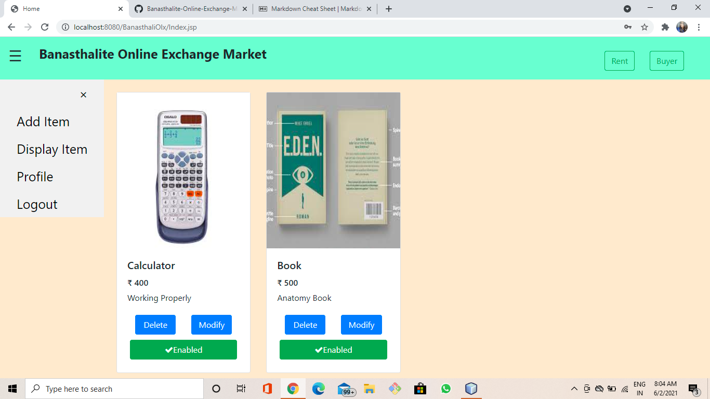

<h4>Add Item</h4>
The seller can post their items by filling out this form. She needs to enter details like name,price,description and required images of the item. Once she posted her item, she can delete, modify, disable/enable her items with the help of the buttons according to her will.
  
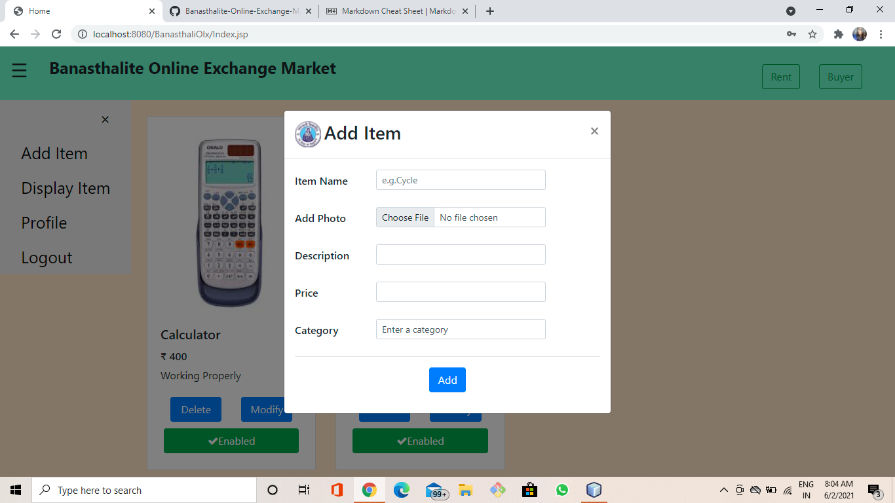

<h5>Display Items-</h5> The seller can see all the items that she has posted with this side menu bar.
<h5>Profile-</h5> The seller can see all her details i.e name, hostels,contact no in this section and she can change it manually..
<h5>Logout-</h5> The seller can logout once she click on this button.

<h4>Rent Interface(Seller Side) </h4>
Seller can rent their items as well. She needs to post their item by clicking on add item on menu nav bar.  After posting her item, she can rent the item by clicking on the rent button. Once, she clicks on the rent button, she will see the issue date and due date so that she can have a reminder.
  
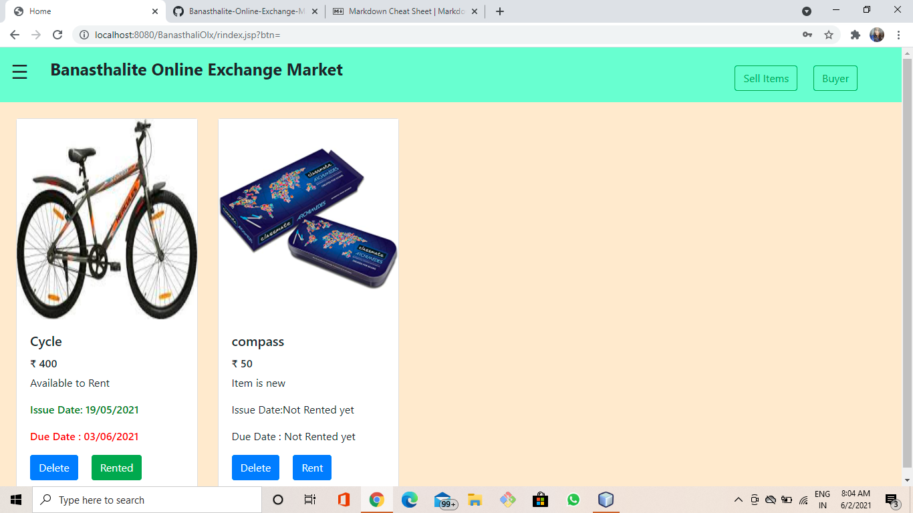
<h4>Side nav bar </h4>
  
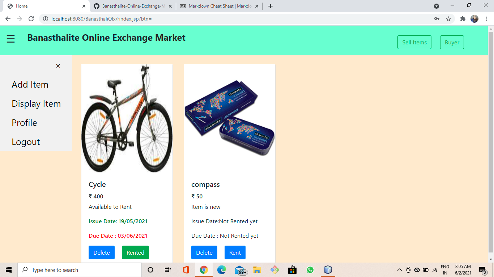

 <h4> Buyer Home Page</h4>
 The top right section has a search bar and three buttons Search, Rent and Seller.The Buyer can find items of her need by searching and clicking on search buttons.She will be redirected to the rent section once she click on rent button and she can switch to seller section with the help of buyer button if she wished to.
   
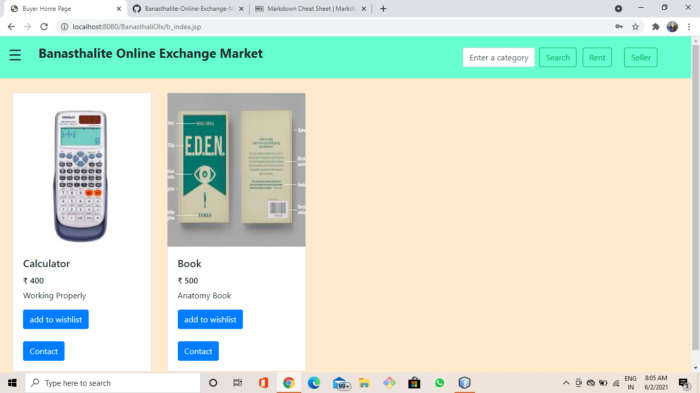

<h4>Buyer side Exploration </h4>
the top left section has a menu bar where we have have these options

* Display Item
* Wishlist
* Profile
* Logout
  
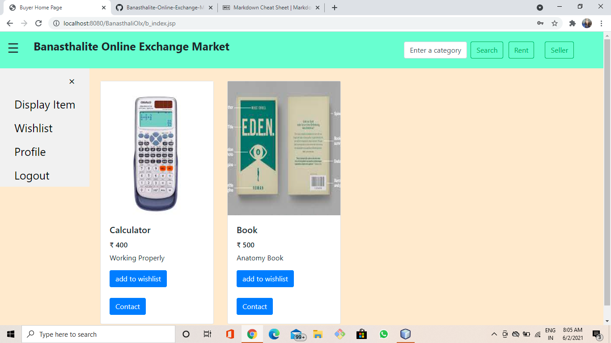
<h5>Display Items-</h5> The buyer can see all the items posted by different sellers.
<h4>Wishlist</h4>
Buyer will have a option to wishlist her items on she click on wishlist button on any items. She can see all her wishlisted items once she clicks on the wishlist button on side menu bar. She can remove her wishlisted items as well as she can have contact details of the seller once she click on the contact button

  
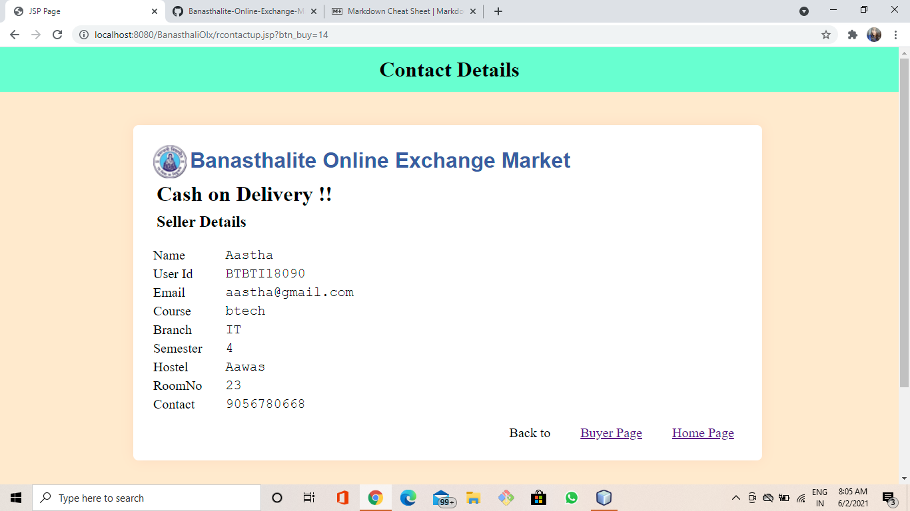

<h5>Profile-</h5> The buyer can see all her details i.e name, hostels,contact no in this section and she can change it manually..
<h5>Logout-</h5> The buyer can logout once she click on this button.

<h4>Rent Interface(Buyer Side) </h4>
The buyer can switch to rent section by clicking on rent button on buyer home page. Here, she can she all the available and not available items. She can contact the seller if she wants to rent any available items or else she can wait till the due date if any item is not available at the moment.
   
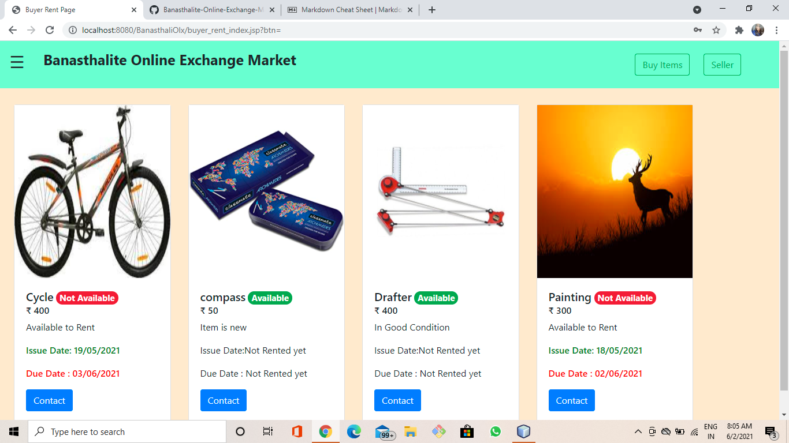

  

   
